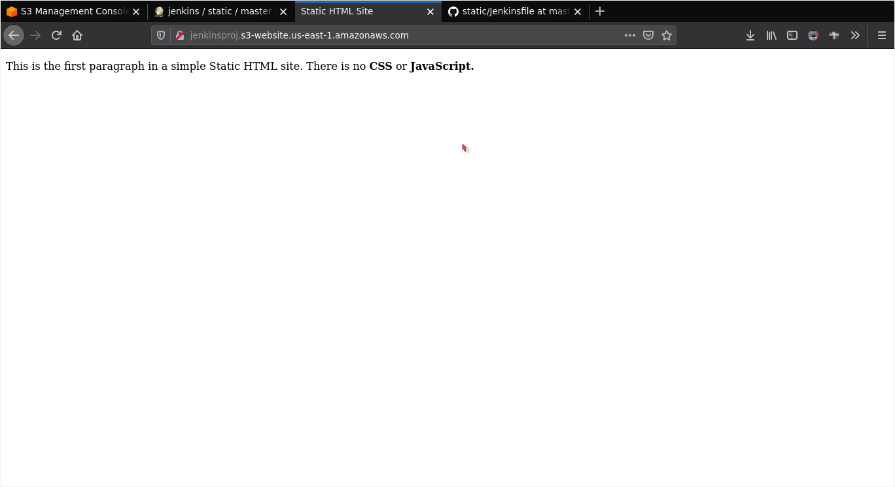

### Jenkins Pipelines on AWS 

The following project perfomed on behalf of Cloud DevOps Engineer nanodegree programme demonstrates a CI pipeline on Jenkins:
    
>> [Multibranch-pipeline](#multi-branch-pipeline) | [Jenkinsfile](#contents-of-jenkinsfile)  | [index.html](#contents-of-indexhtml)


> The whole project is displayed here, in a set of screenshots.

1. Screenshot of the AWS console with the permissions being created.
   
   

2. Screenshot showing the unique AWS URL of your EC2 instance.

    
> URL can be found in the search bar of the browser.

3. Screenshot that includes the unique AWS url (FQDN is used, not the IP).

    
> URL can be found in the search bar of the browser.

4. Screenshot that includes the unique AWS url, and shows the sidebar with the Blue Ocean link (FQDN is used, not the IP).
   
   
> URL can be found in the search bar of the browser.

5. Screenshot that includes the unique AWS url, and shows the GitHub project as a pipeline (FQDN is used, not the IP).
   
   
   
   

6. Screenshot that includes the unique AWS url, and shows "index.html" rendered.

    

    


7. Screenshot that includes the unique AWS url, and shows the failure when linting.

    

8. Screenshot that includes the unique AWS url, and shows passing the linting stage and deploys to S3.

    

_A website health check to our new website and our final pipeline._


_Here is an abstract of using the multibranch pipelines which inturn could explain the blue/green deployement_

> A blue/green deployment, is similar to the canary deployment where two deployments exist and when the new version is available and passes certain conditions, it can be ‘swapped’ for the new one, and otherwise reverting to the older version. Amazon has a guide for CodePipeline that can be used as a reference: https://aws.amazon.com/quickstart/architecture/blue-green-deployment/

### Multi-branch pipeline

    

Insight into code of the other branches (say blue,green)


> Branch blue build fails due to the mismatch in tags used in _index.html_ while the branch green build is successful as the error in _index.html_ is fixed. (This is the foundation of blue/green dployement strategy).

### Contents of Jenkinsfile
  
```
  pipeline {
    agent any
    stages {
        stage('Lint HTML'){
                steps {
                    sh 'tidy -q -e *.html'
                }
            }
        stage('Upload to AWS') {
            steps {
                retry(2){
                withAWS(region:'us-east-1',credentials:'aws-static'){
                    s3Upload(file:'index.html', bucket:'jenkinsproj', path:'')
                }
                }
            }
        }
        stage('Website Status'){
            steps{
                sh '''
                    status=$(curl -Is http://jenkinsproj.s3-website.us-east-1.amazonaws.com/ | head -n 1)
                    echo "$status"
                '''
            }
        }
    }
}
```
### Contents of index.html

```
<!doctype html>
<html>
  <head>
    <title>Static HTML Site</title>
  </head>
  <body>
    <p>This is the first paragraph in a simple Static HTML site. There is no <strong>CSS</strong> or <strong>JavaScript</script>.</p>
  </body>
</html>

```

[Return.](#jenkins-pipelines-on-aws)
